# Raj Bhattacharjea {: style="float:right;width:40px;height:40px;margin-left:5px"} {: style="float:right;width:40px;height:40px;margin-left:5px"} {: style="float:right;width:40px;height:40px;margin-left:5px"} {: style="float:right;width:40px;height:40px;margin-left:5px"} {: style="float:right;width:40px;height:40px;margin-left:5px"}
<!-- :simple-googlescholar::fontawesome-brands-researchgate::fontawesome-brands-linkedin::fontawesome-brands-square-twitter: -->
<!-- {: style="float:left;border-radius:50%;padding-right:10px;width:100px;height:100px"} -->
{: style="float:left;border-radius:50%;width:100px;height:100px;margin-right:1em;"}
I am an Electrical Engineer by training and I'm working as a Machine Learning
Engineer for [DeepSig Inc.](https://www.deepsig.ai/) I'm also an Adjunct Principal Research Engineer with the
[School of Electrical and Computer Engineering at Georgia Tech](https://ece.gatech.edu/).
My goals include conducting and publishing research in the areas of machine learning for radio
and optical communication systems. You'll find a bit about me here, and once in a blue
moon I'll post about topics I'm interested in.
________________________________________________________________________________
# Recent Research Interests
Machine Learning and Artificial Intelligence for Communications Signal Processing

Electro-Optics, Free Space Optical Communications, Fiber Optic Communications,
and Photonics

Near-Field Inductive Communications and Backscatter Communications

Computational Electromagnetics
________________________________________________________________________________
# Courses Taught (Georgia Tech)
ECE3025 Electromagnetics, Spring 2019

ECE2026 Intro to Digital Signal Processing, Summer 2018 and Fall 2018

ECE4012 Senior Capstone Design, Spring 2016
________________________________________________________________________________
# Pre-Prints, Papers, and Presentations
Last updated July 2023.
## Pre-Print: Encoder-Decoder Networks for Signal Bandwidth Estimation on Arrays
This one was accepted for publication at IEEE Array 2022 and my co-author, Nathan West, presented results of this work at the conference.
However, we missed the deadline for submitting the final camera-ready files for archival on IEEE Xplore (oops). So, here's the arXiv version.
[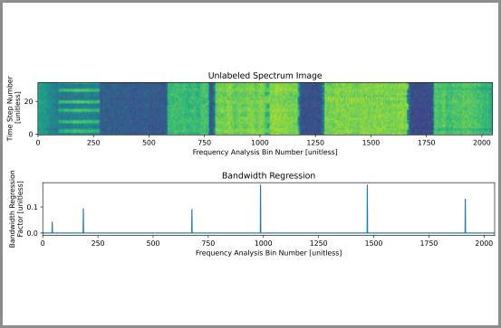](https://arxiv.org/abs/2307.03327)
## Paper: Feedback Magnitude Pruning
[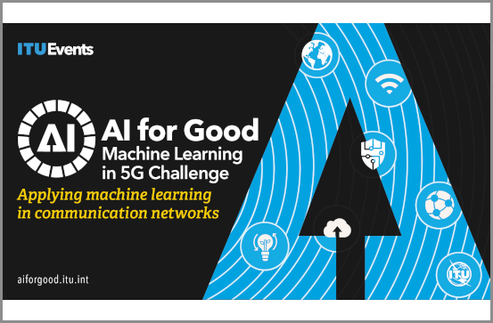](https://www.itu.int/pub/S-JNL-VOL3.ISSUE2-2022-A14)
## Paper: Modulation Pattern Detection Using Complex Convolutions
[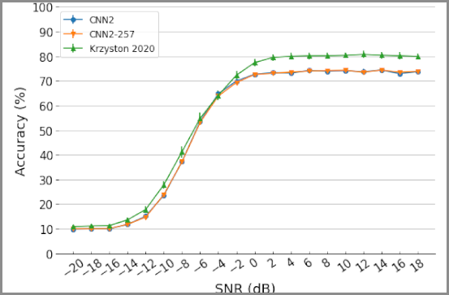](https://ieeexplore.ieee.org/abstract/document/9412382)
## Pre-Print: High-Capacity Complex Convolutional Neural Networks Modulation Classification
[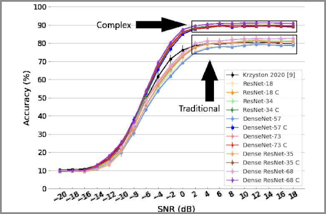](https://arxiv.org/abs/2010.10717)
## Paper: Complex-Valued Convolutions for Modulation Recognition
[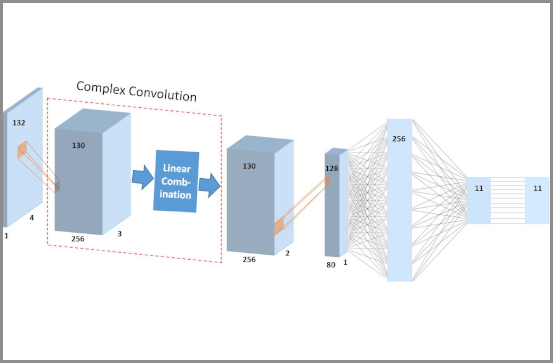](https://ieeexplore.ieee.org/abstract/document/9145469)
## Presentation: Photonic ICs for Channelization and Downconversion
[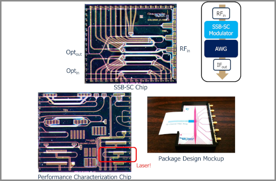](https://www.osti.gov/biblio/1643122)
## Paper: Photonic ICs for Channelization and Downconversion
[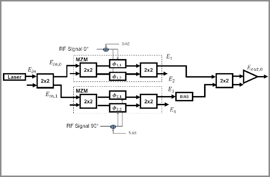](https://ieeexplore.ieee.org/abstract/document/8908217)
## Presentation: Army Signal Classification Challenge
[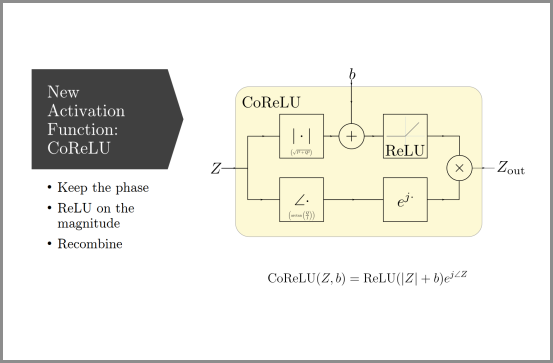](https://www.gnuradio.org/grcon/grcon18/presentations/RadioML_Redux_GTRI_Efforts_on_the_Army_Signal_Classification_Challenge/)
## Paper: ReMoRa
[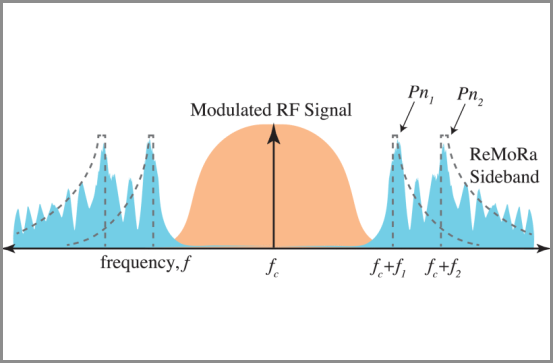](https://ieeexplore.ieee.org/document/8046154)
## Paper: Perfect Pulses
[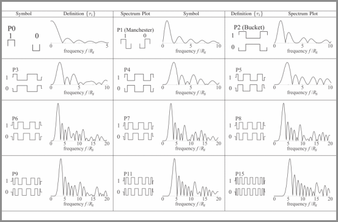](https://ieeexplore.ieee.org/document/7945580)
## Presentation: Accelerated Signal Processing on Embedded Platforms
[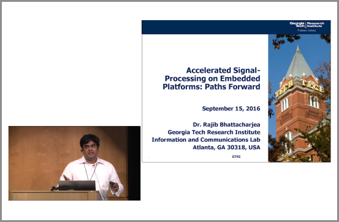](https://youtu.be/NK4BaqBuzbk)
## Presentation: Open Source SDR on Embedded Platforms
[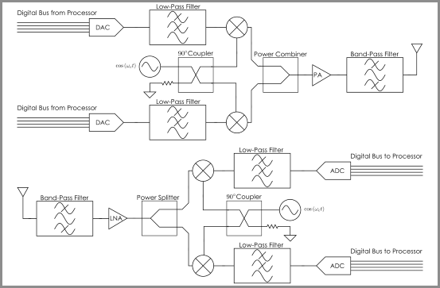](https://www.researchgate.net/publication/304346578_Open-Source_SDR_on_Embedded_Platforms)
## Dissertation: Refractive Near-Earth UHF Channels
[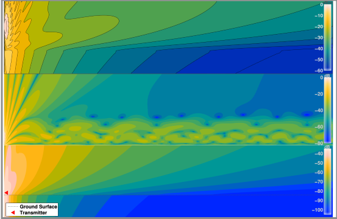](https://smartech.gatech.edu/handle/1853/53002)
## Paper: Near-Ground Vertical Dipoles in Atmospheric Refractivity
[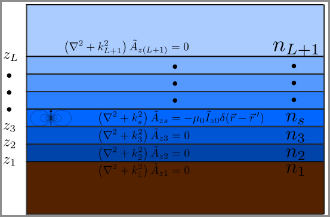](1P_11_0320.pdf)
## Presentation: Near-Ground Vertical Dipoles in Atmospheric Refractivity
[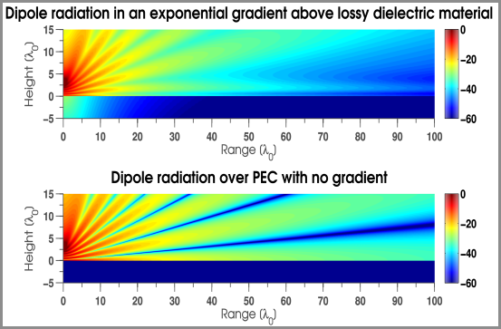](Bhattacharjea_Presentation_PIERS2013_Stockholm.pdf)
## Paper: Rician Fading Estimation
[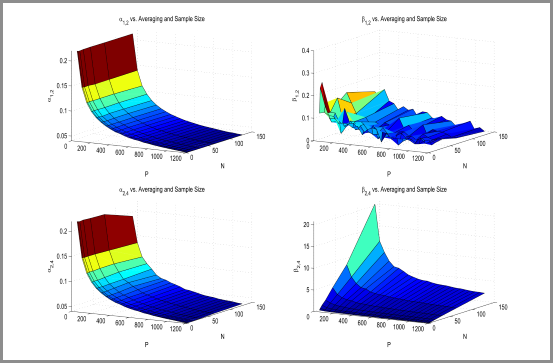](https://ieeexplore.ieee.org/document/6327312)